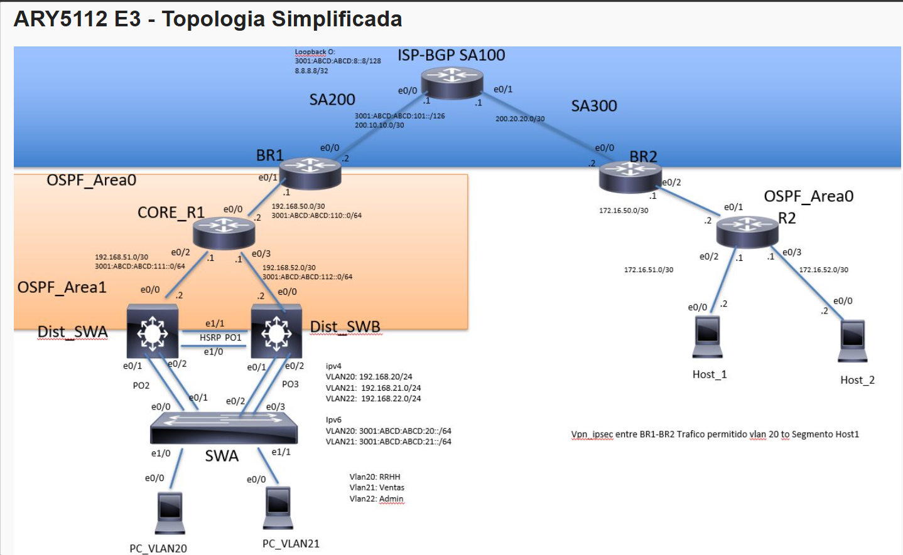

# Cisco Multi-AS Network Lab — BGP, OSPF Multiárea, EtherChannel, HSRP y VPN IPSec

Laboratorio de red empresarial simulado en **EVE-NG / IOU Web**, diseñado para integrar múltiples protocolos de enrutamiento y conmutación en un escenario realista de interconexión entre tres sistemas autónomos, con verificación end-to-end y documentación de troubleshooting real.

## Topología



La red simula tres organizaciones interconectadas por un ISP central (AS100), cada una representando un sistema autónomo independiente con su propia infraestructura interna.

```
ISP-BGP-SA100 (AS100)
├── BR1 (AS200) → CORE_R1 → Dist_SWA ─── Acceso_SW1 (VLANs 20/21/22)
│                              Dist_SWB ──┘
└── BR2 (AS300) → CORE_R2 → Host_1, Host_2
```

El lado izquierdo (AS200) implementa una topología jerárquica de tres capas (Core / Distribución / Acceso) con redundancia vía HSRP y EtherChannel. El lado derecho (AS300) usa una topología simplificada de tres routers, conforme al alcance reducido del lab.

## Tecnologías implementadas

| Tecnología | Alcance |
|---|---|
| **BGP** | eBGP entre AS100↔AS200 y AS100↔AS300, con redistribución mutua BGP↔OSPF en ambos bordes |
| **OSPF multiárea** | Área 0 (BR1-CORE_R1, BR2-CORE_R2) y Área 1 (CORE_R1-Dist_SWA/SWB), con CORE_R1 como ABR |
| **EtherChannel** | Po1/Po2/Po3 con LACP (modo active) entre Dist_SWA, Dist_SWB y Acceso_SW1 |
| **STP** | PVST+, BPDUGuard y PortFast en puertos de acceso a endpoints |
| **Port-Security** | Modo sticky con violation restrict en puertos de acceso (Acceso_SW1) |
| **HSRP** | IPv4 e IPv6 (grupos separados) en Dist_SWA (Active, prioridad 110) y Dist_SWB (Standby, prioridad 100) |
| **VPN IPSec Site-to-Site** | Túnel BR1↔BR2, tráfico cifrado restringido a VLAN20 → segmento Host_1 |
| **Control de acceso (ACL)** | ACL extendida de filtrado en CORE_R1 que restringe el acceso a Host_1 únicamente a VLAN20 |
| **Dual-stack IPv4/IPv6** | En todas las interfaces de la topología |

## Estructura del repositorio

```
.
├── README.md                       Este archivo
├── lessons-learned.md              Troubleshooting real: síntomas, diagnóstico y solución
├── docs/
│   ├── topology-diagram.png        Diagrama de la topología
│   └── addressing-table.md         Tabla completa de direccionamiento (IPv4, IPv6, HSRP, VLANs, BGP, VPN, ACL)
├── configs/                        show running-config de cada dispositivo
│   ├── ISP.txt
│   ├── BR1.txt        BR2.txt
│   ├── CORE_R1.txt    CORE_R2.txt
│   ├── Dist_SWA.txt   Dist_SWB.txt
│   └── Acceso_SW1.txt
└── verification/                   Evidencia de comandos por protocolo
    ├── bgp-verification.md
    ├── ospf-verification.md
    ├── etherchannel-hsrp.md
    └── ipsec-vpn-verification.md
```

## Verificación end-to-end

Toda la conectividad fue verificada con evidencia de comandos reales:

- **BGP**: tres sesiones eBGP `Established`, prefijos intercambiados, table version sincronizada.
- **OSPF**: adyacencias `FULL` en CORE_R1 (ABR) y BR2↔CORE_R2; rutas inter-área y externas E2 propagadas en ambos sentidos.
- **EtherChannel/HSRP**: los tres Port-Channels con ambos miembros `(P)` (bundled); HSRP convergido en IPv4 e IPv6 (Dist_SWA Active / Dist_SWB Standby).
- **VPN IPSec**: SA bidireccional con `encaps/decaps` simétricos y SPI espejo; ping VLAN20→Host_1 al 100% (control positivo) y VLAN21→Host_1 bloqueado al 0% por la ACL de filtrado (control negativo).

Ver la carpeta [verification/](verification/) para el detalle de cada protocolo.

## Problemas encontrados y resueltos

Este lab documenta troubleshooting real, no solo configuración exitosa al primer intento. Entre los hallazgos: channel-groups de EtherChannel mal mapeados causando split-brain de HSRP, ACL cripto no-espejo, redistribución mutua BGP↔OSPF faltante, la diferencia entre cifrar tráfico (cripto-ACL) y controlar acceso (ACL de filtrado), y el comportamiento del Initial Config de IOU Web que revierte la NVRAM al reiniciar la VM completa.

Ver [lessons-learned.md](lessons-learned.md) para el detalle de cada problema, su diagnóstico y su solución.

## Autor

Diego — Estudiante de Ingeniería en Conectividad y Redes, Duoc UC.
